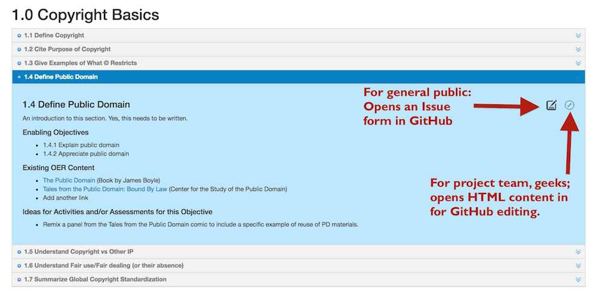

# We Want to Make Contributing Easy
GitHub can be a confusing space but it well serves the purpose of the Creative Commons Certification project. You will not need to know how GitHUb works nor any geeky words like **forking** or **pulling**. This is what a typical objective section on the map will look like:

You can help contribute to any objective in the [Core Certification Map](http://creativecommons.github.io/cc-cert-map/core.html) by clicking the **Comment** icon .

This will open [a GitHub Issue](https://github.com/creativecommons/cc-cert-map/issues), which is really just like a blog comment. You can tell us the things you are suggesting for that objective. We seek three kinds of input (which you will see in the issue form's template):

* **Suggestions for wording of the objective's introduction:** Any ideas that will help explain it better
* **Open Education Resources that can help explain the objective:** We are hoping to leverage as much as possible exisiting OERs, so we just ask for a title, URL, name of the publishing person or organization, and its license. Feel free to add more than one. A lot more.
* **Ideas for Assessing the Objective** This is maybe the most important piece; what can a person do to demonstrative their mastering of this objective? We seek action oriented activities.

## What Happens Next?
The issues are submittted to the project team, who will review, and likely add your suggestions to the Map. We may contact you for clarification. But because of the affordances of GutHub, you will notified at all stages of the actions taken on your suggestion.

## What is that Other Icon?
The gear icon  gives people who are collaborators access to directly edit the HTML content for that objective. If you are comfortable in that way of working, and know your way with GitHub, you can submit it directly as a pull request. 
