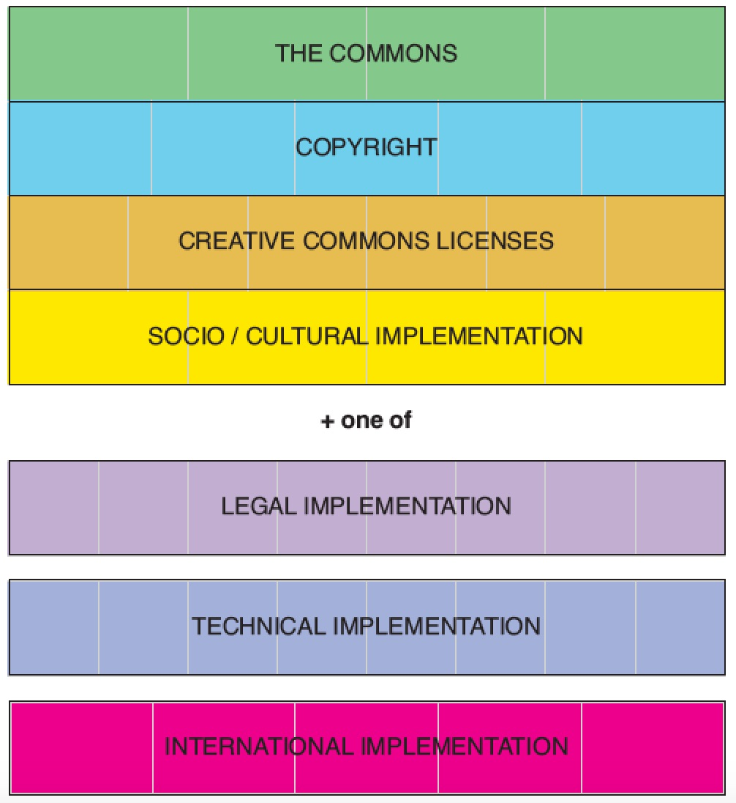
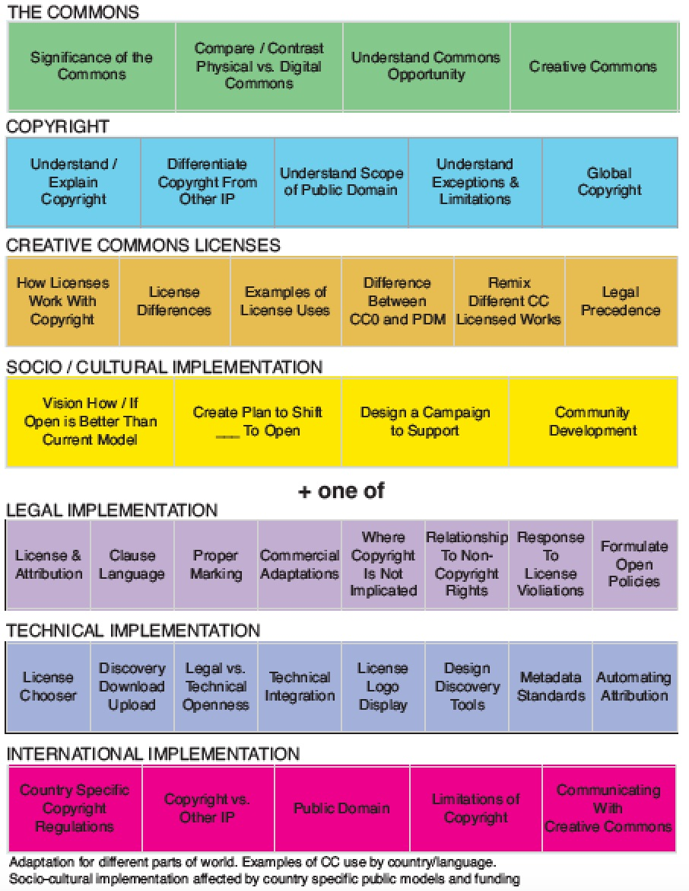

# Introduction to Creative Commons CORE

CORE is a learning blueprint for acquiring comprehenive Creative Commons knowledge and skill. 

CORE is for those seeking deep Creative Commons expertise, including those invovled in intensive use of Creative Commons and those who lead and support use of Creative Commons by others. CORE is the means by which someone becomes certified to train others about Creative Commons.

The comprehensive breadth of CORE is shown across seven modules and their associated learning units. Depth is defined by learning objectives within each unit. 

CORE emphasizes performance based learning with learning objectives fulfilled through applied use. Acquisition of knowledge and skill is demonstrated through generation of Creative Commons licensed works. 

CORE is Creative Commons licensed including the content, learning activities, and participant proof of completion. 

CORE is continuously created through remix of existing Open Educational Resources (OER) and participant creation of new OER. 

Creative Commons is the curator of CORE rather than sole creator of CORE. 

CORE is foundational curricula from which specialized Creative Commons certificates can be built. 

CORE has required and optional modules.

* **Required Modules**
  * [The Commons](core/commons.md)
  * [Copyright Basics](core/copyright.md)
  * [CC License Suite](core/licenses.md)
  * [Social/Cultural Implementation](core/social-cultural.md)
  
* Plus one or more **Optional Modules**
  * [Legal Implementation](core/legal.md)
  * [Technical Implementation](core/technical.md)
  * [International Implementation](core/international.md)

Optional modules provide participants with the opportunity to gain deeper knowledge directly related to their interests or needs. 

## CORE Modules
CORE can be visualized as a set of modules that fit together like this:

The pale grey lines divide each module into units of learning. 

## Units of Learning

CORE units of learning across all modules are:

