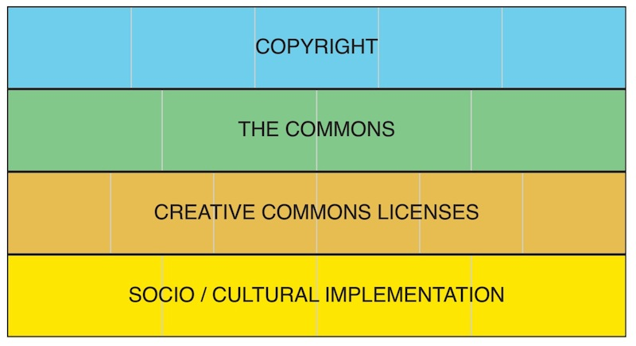
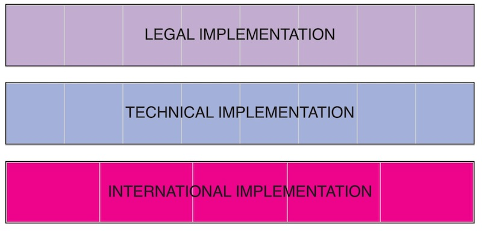
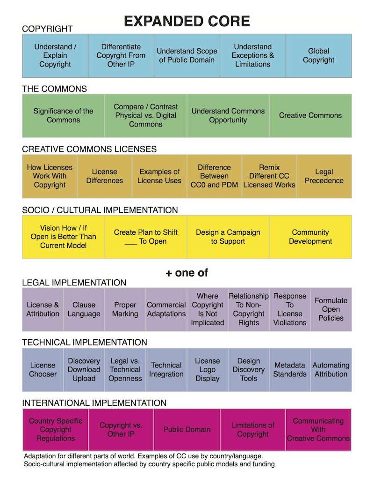

# Introduction to Creative Commons CORE

Creative Commons CORE is a learning blueprint for acquiring comprehenive Creative Commons knowledge and skill. 

CORE is for those seeking deep Creative Commons expertise, including those who lead and support others in use of Creative Commons.

The comprehensive nature of CORE is shown through breadth and depth. CORE breadth is conveyed through seven modules and their associated learning units. Depth is defined by learning objectives within each unit. CORE emphasizes performance based learning with learning objectives fulfilled through applied use generating tangible evidence of capability. 

CORE is Creative Commons licensed including the content, learning activities, and targeted participant outputs. 

CORE is continuously created through remix of existing Open Educational Resources (OER) and participant creation of new OER. 

Creative Commons is a curator of CORE rather than sole creator of CORE. 

CORE learning activities are oriented toward applied use.  with participants demonstrating acquisition of knowledge and skills through personal action and use.  

CORE is foundational curricula from which specialized Creative Commons certificates can be built. 

CORE has required and optional modules.

* **Required Modules**
  * [Copyright Basics](core/copyright.md)
  * [The Commons](core/commons.md)
  * [CC License Suite](core/licenses.md)
  * [Social/Cultural Implementation](core/social-cultural.md)
  
* Plus one or more **Optional Modules**
  * [Legal Implementation](core/legal.md)
  * [Technical Implementation](core/technical.md)
  * [International Implementation](core/international.md)

Optional modules provide participants with the opportunity to gain deeper knowledge directly related to their interests or needs. CORE in it's entirety (all of required and all of optional) is the means by which someone becomes certified as a Creative Commons train-the-trainer.

## CORE Modules
CORE can be visualized as a set of modules that fit together like this:

plus one of

## CORE Module Units of Learning

The pale grey lines in the diagram divide each CORE module into units of learning. CORE units of learning across all modules are:

